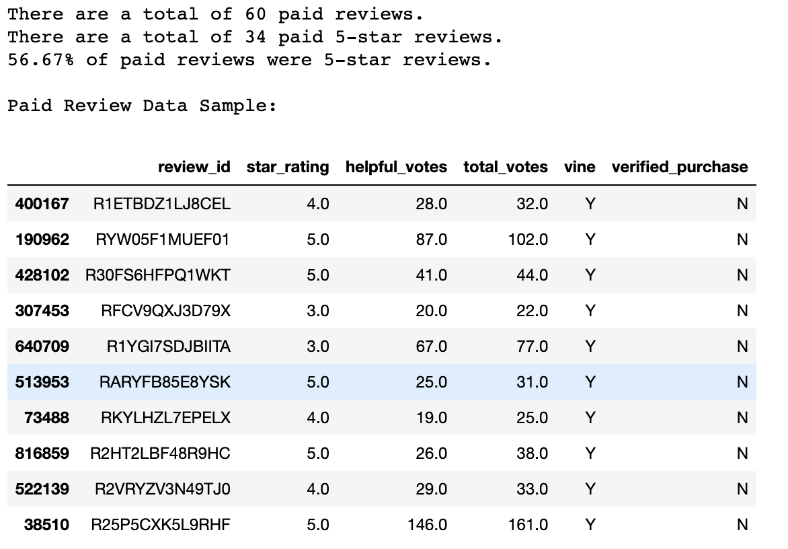
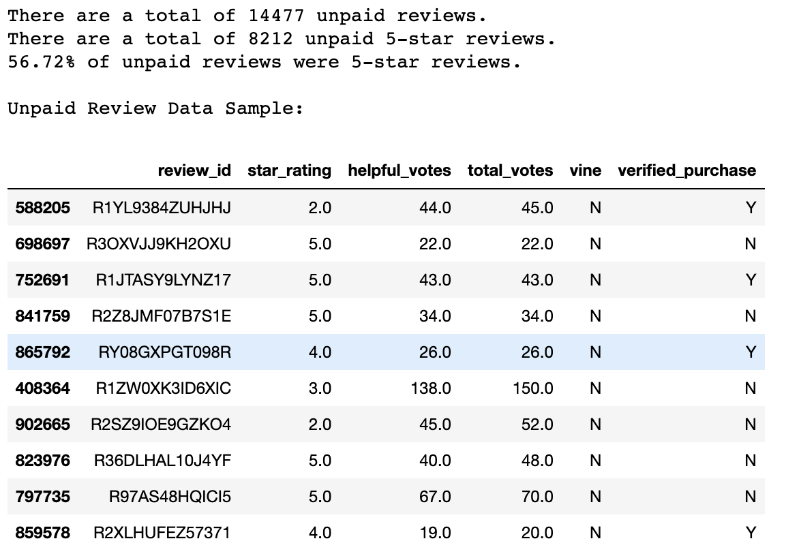

# Amazon Vine Analysis

## Overview
The purpose of this analysis is to determine if paid product reviews tend to receive more 5-star ratings than do unpaid reviews. The data for this analysis is from a publicly available database of Amazon product reviews which includes data indicating whether or not the review is part of the paid “Vine” program. 

This analysis included the following actions,
- Open a PySpark session in a Google Colab Notebook.
- Import the Amazon review data.
- Create a database instance on Amazon AWS Relational Database Service (RDS).
- Connect PostgreSQL via pgAdmin and create tables.
- With PySpark, break data into relevant tables and send them to AWS database.
- Export data with pgAdmin.
- Use Python Pandas library in Jupyter Notebook to import Amazon review data.
- Analyze data in Pandas to determine results.
- Report results in the following sections of this ReadMe.

## Results
Refer to the following breakdowns of paid and unpaid reviews:

### Paid Reviews Breakdown

### Unpaid Reviews Breakdown

### Comparison
Total Reviews:
Vine: 60 		Non-Vine: 14,447

5-Star Reviews:
Vine: 34 		Non-Vine: 8,212

Proportion of 5-Star Reviews to Total Reviews:
Vine: 56.67% 		Non-Vine: 56.72%

## Summary
The results of this study suggest that there is no positivity bias for reviews in the Vine program among this dates. Although there are drastically less Vine reviews than non-Vine reviews, the respective proportions of 5-star reviews are almost identical. There is only a 0.05% difference (5 one-hundredths of a percent). Additionally, if that difference were significant, it would suggest that the positivity bias lies in the non-Vine reviews, which received the greater proportion of 5-star reviews.

One could also conduct a T-Test on this data to determine the presence of positivity bias amongst Vine reviews. Rather than comparing 5-start to non-5-star reviews, this analysis will take the mean of Vine reviews and test it against the mean of all reviews, the population mean. If the T-Test returns a p-value over 0.05, we can conclude that Vine reviews are statistically different from the population. If the Vine review mean is above the population mean, this would indicate the presence of positivity bias amongst Vine reviews. 